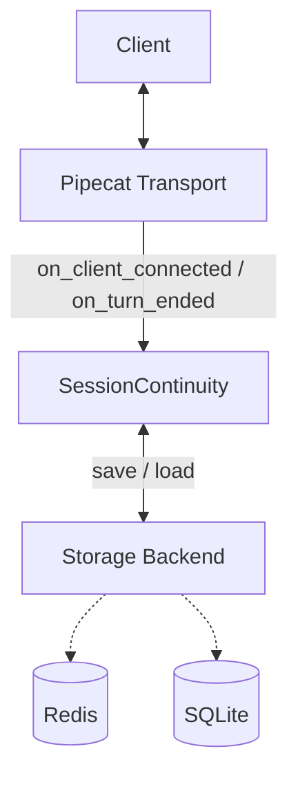

# pipecat-session-continuity

[](https://pypi.org/project/pipecat-session-continuity/)
[](https://github.com/meet987654/pipecat-session-continuity/actions)
[](https://opensource.org/licenses/MIT)
[](https://www.python.org/downloads/)

**Drop-in session continuity & connection resilience for Pipecat 1.5 voice agents.**

When a client disconnects (network drop, browser refresh, mobile backgrounding), this library saves the LLM context + pending tool calls and restores them cleanly on reconnect — so the conversation continues instead of starting over.

---

## Features
- Checkpoint LLM context + pending tool calls to Redis (SQLite support planned)
- Secure session tokens with HMAC signature (prevents session forgery)
- Resume conversation state on client reconnect
- Idempotent tool-call handling (reduces duplicate actions after recovery)
- Simple drop-in API designed for Pipecat event handlers
- Explicitly documented limitations (production-ready honesty)

## Installation
```bash
pip install pipecat-session-continuity
# or
uv add pipecat-session-continuity
```

## Quick Start

```python
from pipecat_session_continuity import SessionContinuity

continuity = SessionContinuity()  # Defaults to localhost:6379 Redis

@transport.event_handler("on_client_connected")
async def on_client_connected(transport, client):
    # Resume existing session context or start fresh
    is_resumed, pending_tools = await continuity.resume_or_start(task, context, session_id)
    
    if is_resumed:
        print(f"Welcome back! Restored {len(context.messages)} messages.")

# Hook into the pipeline to securely save state when the LLM finishes speaking
turn_observer = task.turn_tracking_observer
if turn_observer:
    @turn_observer.event_handler("on_turn_ended")
    async def on_turn_ended(observer, *args, **kwargs):
        await continuity.checkpoint(context, session_id, session_pending_tool_calls)
```

## Architecture



## Full API Documentation
For full installation details, API documentation, and configuration options, see the **[Full Documentation](pipecat_session_continuity/README.md)**.

## Current Limitations
This library currently has a few intentional boundaries:
- It only persists the `LLMContext` (messages array) and pending tool calls. It does not attempt to serialize the state of other pipeline processors (like VAD state or STT buffers).
- It relies entirely on Redis for the store.
- **Tool-Call Re-initiation gap**: Idempotency is keyed strictly on Pipecat's `tool_call_id`. After a session resumes, the LLM has no reason to reuse that specific ID for interrupted work, and will often generate a brand-new tool call with a new ID for the exact same logical action. **Mitigation**: This library intercepts pending tools and injects an explicit system message (`"Do NOT call this tool again for the same request..."`) pointing to the specific tool name. *Note: This is a robust mitigation that drastically reduces duplicate actions, but it is NOT a hard guarantee, as the LLM can still technically ignore the system instruction.*

## Roadmap / Planned Features
- [ ] Better tool-call idempotency (deterministic IDs based on arguments)
- [ ] Full pipeline state serialization (optional)
- [ ] SQLite backend as default for local/dev
- [ ] Prometheus / OpenTelemetry metrics export
- [ ] Support for Pipecat Cloud session API
- [ ] Multi-worker / distributed Redis locking

## Contributing
Contributions are very welcome!

- Bug reports → open an Issue
- Feature ideas → open a Discussion or Issue
- Code → see [CONTRIBUTING.md](CONTRIBUTING.md)

We especially welcome help with:
- Improving tool-call idempotency
- Adding more storage backends
- Production battle-testing & edge cases
- Documentation & examples

Join the discussion and share your use cases in our [GitHub Discussions](https://github.com/meet987654/pipecat-session-continuity/discussions) or the Pipecat Discord.

## License
MIT
