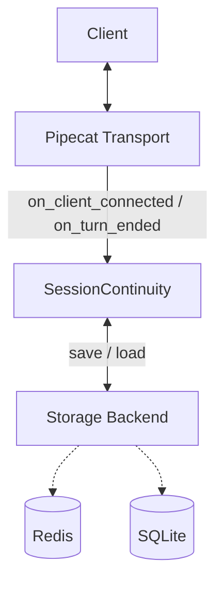

# pipecat-session-continuity

[](https://pypi.org/project/pipecat-session-continuity/)
[](https://github.com/meet987654/pipecat-session-continuity/actions)
[](https://opensource.org/licenses/MIT)
[](https://www.python.org/downloads/)

**Drop-in session continuity & connection resilience for Pipecat 1.5 voice agents.**

When a client disconnects (network drop, browser refresh, mobile backgrounding), this library saves the LLM context + pending tool calls and restores them cleanly on reconnect — so the conversation continues instead of starting over.

---

## Features
- Checkpoint LLM context + pending tool calls to Redis and SQLite
- Secure session tokens with HMAC signature (prevents session forgery)
- Resume conversation state on client reconnect
- **Robust tool-call idempotency**: Deterministic keys (tool_name + canonical arguments hash), client-side tokens, and dual-index lookup to prevent duplicate actions even if LLM generates new `tool_call_id`s on reconnect
- Stronger contextual system prompts injected on resume for pending and completed tools
- Simple drop-in API designed for Pipecat event handlers
- Explicitly documented limitations (production-ready honesty)

## Installation
```bash
pip install pipecat-session-continuity
# or
uv add pipecat-session-continuity
```

## Quick Start

```python
from pipecat_session_continuity import SessionContinuity

continuity = SessionContinuity()  # Defaults to localhost:6379 Redis

@transport.event_handler("on_client_connected")
async def on_client_connected(transport, client):
    # Resume existing session context or start fresh
    is_resumed, pending_tools = await continuity.resume_or_start(task, context, session_id)
    
    if is_resumed:
        print(f"Welcome back! Restored {len(context.messages)} messages.")

# Inside your tool execution handler:
async def my_tool(params, **kwargs):
    call_id = params.tool_call_id
    
    # 1. Deterministic check (identifies duplicates even if LLM generated a new tool_call_id)
    is_dup, entry = continuity.check_tool_idempotency(
        pending_tool_calls=pending_tools,
        tool_name="my_tool",
        arguments=kwargs,
        tool_call_id=call_id,
    )
    if is_dup and entry:
        if entry["status"] == "completed":
            return f"Already completed: {entry['result']}"
        elif entry["status"] == "pending":
            return "Interrupted during prior attempt; please confirm before retrying."

    # 2. Record pending state
    continuity.record_tool_call(pending_tools, "my_tool", arguments=kwargs, tool_call_id=call_id)
    await continuity.checkpoint(context, session_id, pending_tools)

    # 3. Execute action
    result = await execute_action(**kwargs)

    # 4. Mark complete
    continuity.complete_tool_call(pending_tools, call_id, result=result)
    await continuity.checkpoint(context, session_id, pending_tools)
    return result

# Hook into the pipeline to securely save state when the LLM finishes speaking
turn_observer = task.turn_tracking_observer
if turn_observer:
    @turn_observer.event_handler("on_turn_ended")
    async def on_turn_ended(observer, *args, **kwargs):
        await continuity.checkpoint(context, session_id, session_pending_tool_calls)
```

## Architecture


```mermaid
graph TD
    Client[Client] <--> Transport[Pipecat Transport]
    Transport -->|on_client_connected / on_turn_ended| Continuity[SessionContinuity]
    Continuity <-->|save / load| Storage[Storage Backend]
    Storage -.-> Redis[(Redis)]
    Storage -.-> SQLite[(SQLite)]
```

## Full API Documentation
For full installation details, API documentation, and configuration options, see the **[Full Documentation](pipecat_session_continuity/README.md)**.

## Current Limitations
This library currently has a few intentional boundaries:
- It only persists the `LLMContext` (messages array) and pending tool calls. It does not attempt to serialize the state of other pipeline processors (like VAD state or STT buffers).
- While deterministic tool keys and system prompt injection prevent duplicate tool execution at the agent boundary, non-deterministic arguments (e.g. dynamic current timestamps generated inside LLM argument JSON) may generate distinct hashes unless a client-side idempotency token is supplied.

## Roadmap / Planned Features
- [x] Better tool-call idempotency (deterministic IDs based on tool + arguments & client tokens - #1)
- [x] SQLite backend for local/dev
- [ ] Full pipeline state serialization (optional)
- [ ] Prometheus / OpenTelemetry metrics export
- [ ] Support for Pipecat Cloud session API
- [ ] Multi-worker / distributed Redis locking

## Contributing
Contributions are very welcome!

- Bug reports → open an Issue
- Feature ideas → open a Discussion or Issue
- Code → see [CONTRIBUTING.md](CONTRIBUTING.md)

We especially welcome help with:
- Improving tool-call idempotency
- Adding more storage backends
- Production battle-testing & edge cases
- Documentation & examples

Join the discussion and share your use cases in our [GitHub Discussions](https://github.com/meet987654/pipecat-session-continuity/discussions) or the Pipecat Discord.

## License
MIT
