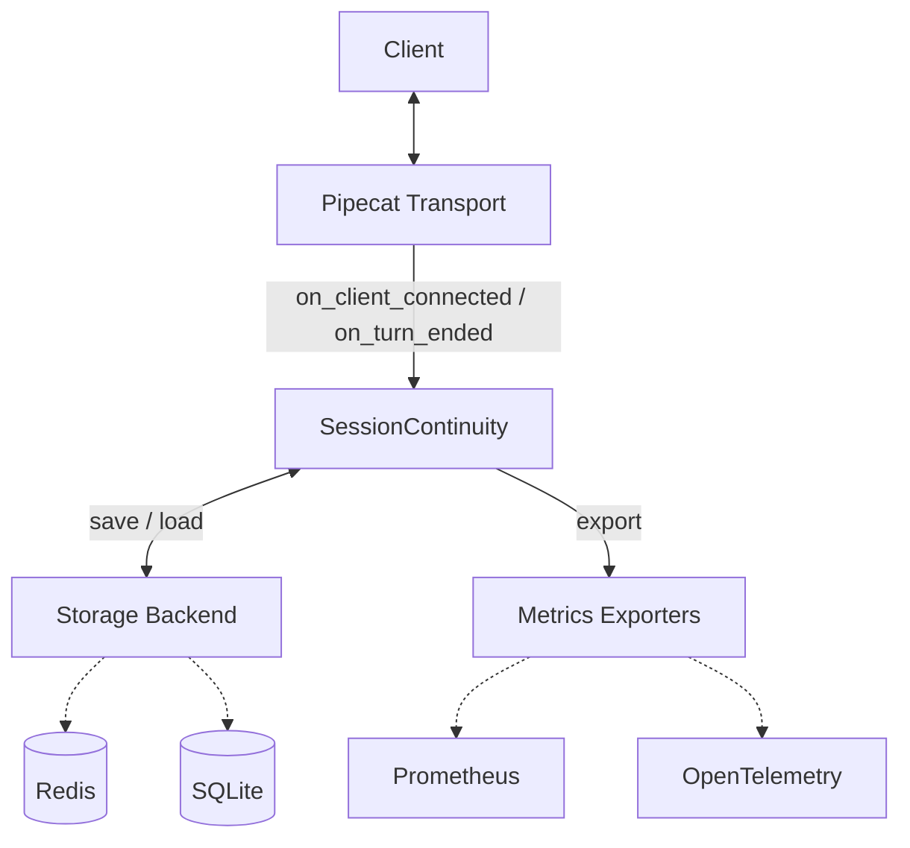

# pipecat-session-continuity

[](https://pypi.org/project/pipecat-session-continuity/)
[](https://github.com/meet987654/pipecat-session-continuity/actions)
[](https://opensource.org/licenses/MIT)
[](https://www.python.org/downloads/)

**Drop-in session continuity & connection resilience for Pipecat 1.5 voice agents.**

When a client disconnects (network drop, browser refresh, mobile backgrounding), this library saves the LLM context + pending tool calls and restores them cleanly on reconnect — so the conversation continues instead of starting over.

---

## Features
- **Default SQLite storage**: Zero-config local development out of the box (persists to `pipecat_sessions.db` with no Redis or Docker needed)
- **Production Redis storage**: Seamless scale-out via `redis_url` or custom storage backends
- Secure session tokens with HMAC signature (prevents session forgery)
- Resume conversation state on client reconnect
- **Robust tool-call idempotency**: Deterministic keys (tool_name + canonical arguments hash), client-side tokens, and dual-index lookup to prevent duplicate actions even if LLM generates new `tool_call_id`s on reconnect
- Stronger contextual system prompts injected on resume for pending and completed tools
- **Prometheus & OpenTelemetry metrics export**: Production-ready observability for checkpoint latency (histograms), resume success/error rates, reconnect counts, and tool execution status
- Simple drop-in API designed for Pipecat event handlers
- Explicitly documented limitations (production-ready honesty)

## Installation
```bash
pip install pipecat-session-continuity

# With Prometheus support:
pip install "pipecat-session-continuity[prometheus]"

# With OpenTelemetry support:
pip install "pipecat-session-continuity[opentelemetry]"
```

## Quick Start

```python
from pipecat_session_continuity import SessionContinuity

# Zero-config: defaults to local SQLiteStorage ("pipecat_sessions.db")
# with optional first-class Prometheus metrics export enabled:
continuity = SessionContinuity(enable_prometheus=True)

# Or specify a custom SQLite db path:
# continuity = SessionContinuity(db_path="my_sessions.db")

# Or connect to Redis for distributed multi-worker production:
# continuity = SessionContinuity(redis_url="redis://localhost:6379", enable_prometheus=True)
```

## Production Observability (Prometheus & OpenTelemetry)

First-class exporters make monitoring checkpoint latency and reconnect reliability effortless in multi-worker production environments.

### Prometheus

Expose standard Prometheus metrics via FastAPI, aiohttp, or Flask:

```python
from fastapi import FastAPI, Response
from pipecat_session_continuity import SessionContinuity

app = FastAPI()
continuity = SessionContinuity(enable_prometheus=True)

@app.get("/metrics")
async def metrics():
    # Returns standard Prometheus exposition format
    return Response(
        content=continuity.get_prometheus_metrics(),
        media_type="text/plain; version=0.0.4"
    )
```

Exported metrics:
- `pipecat_session_checkpoint_latency_ms`: Histogram of context checkpoint save duration with `status` label (`success`, `error`).
- `pipecat_session_checkpoints_total`: Counter of all checkpoint operations.
- `pipecat_session_resume_latency_ms`: Histogram of resume and session startup latencies.
- `pipecat_session_resumes_total`: Counter of resumes with `is_resumed` and `status` labels.
- `pipecat_session_reconnects_total`: Counter of actual client reconnect events.
- `pipecat_session_tool_calls_total`: Counter of tool calls with `tool_name` and `status` labels (`pending`, `completed`, `duplicate`).

### OpenTelemetry

Use the OpenTelemetry Metrics API exporter to forward metrics to OTel collectors (Datadog, Dynatrace, New Relic, Grafana Tempo):

```python
from pipecat_session_continuity import SessionContinuity

continuity = SessionContinuity(enable_opentelemetry=True)
```

## Architecture


```mermaid
graph TD
    Client[Client] <--> Transport[Pipecat Transport]
    Transport -->|on_client_connected / on_turn_ended| Continuity[SessionContinuity]
    Continuity <-->|save / load| Storage[Storage Backend]
    Continuity -->|export| Exporters[Metrics Exporters]
    Storage -.-> Redis[(Redis)]
    Storage -.-> SQLite[(SQLite)]
    Exporters -.-> Prom[Prometheus]
    Exporters -.-> OTel[OpenTelemetry]
```

## Realistic Failure & Chaos Testing Examples

Production voice applications rarely experience clean disconnects. We provide dedicated, runnable failure scripts in the **[`examples/`](examples/README.md)** directory:

1. **[Hard Process Kill & Recovery](examples/01_hard_process_kill.py)** (`01_hard_process_kill.py`):
   Simulates catastrophic backend termination (`SIGKILL`, OOM, Kubernetes pod eviction) mid-sentence, starts a completely fresh worker process, and resumes state seamlessly with zero duplicate tool executions.
   ```bash
   python examples/01_hard_process_kill.py
   ```

2. **[Simulated Network Failures](examples/02_simulated_network_failures.py)** (`02_simulated_network_failures.py`):
   Simulates transient TCP resets, in-flight action drops (preventing double billing on interrupted payment calls), and mobile backgrounding stale resumes.
   ```bash
   python examples/02_simulated_network_failures.py
   ```

3. **[Client-Side Reconnect Flow & Backoff](examples/03_client_reconnect_flow.py)** (`03_client_reconnect_flow.py`):
   Reference client architecture demonstrating token caching, exponential backoff with full jitter, and client-side idempotency tokens.
   ```bash
   python examples/03_client_reconnect_flow.py
   ```

## Full API Documentation
For full installation details, API documentation, and configuration options, see the **[Full Documentation](pipecat_session_continuity/README.md)**.

## Current Limitations
This library currently has a few intentional boundaries:
- It only persists the `LLMContext` (messages array) and pending tool calls. It does not attempt to serialize the state of other pipeline processors (like VAD state or STT buffers).
- While deterministic tool keys and system prompt injection prevent duplicate tool execution at the agent boundary, non-deterministic arguments (e.g. dynamic current timestamps generated inside LLM argument JSON) may generate distinct hashes unless a client-side idempotency token is supplied.

## Roadmap / Planned Features
- [x] Better tool-call idempotency (deterministic IDs based on tool + arguments & client tokens - #1)
- [x] SQLite backend as default for local/dev (#2)
- [x] Prometheus / OpenTelemetry metrics export (#3)
- [x] Realistic hard-reconnect and network-failure examples (#4)
- [ ] Full pipeline state serialization (optional)
- [ ] Support for Pipecat Cloud session API
- [ ] Multi-worker / distributed Redis locking

## Contributing
Contributions are very welcome!

- Bug reports → open an Issue
- Feature ideas → open a Discussion or Issue
- Code → see [CONTRIBUTING.md](CONTRIBUTING.md)

We especially welcome help with:
- Improving tool-call idempotency
- Adding more storage backends
- Production battle-testing & edge cases
- Documentation & examples

Join the discussion and share your use cases in our [GitHub Discussions](https://github.com/meet987654/pipecat-session-continuity/discussions) or the Pipecat Discord.

## License
MIT
